# Chimera Linux

## Goal

This document will walk you through installing [Chimera Linux](https://en.wikipedia.org/wiki/Chimera_Linux)
with [KDE Plasma](https://kde.org/plasma-desktop/) on top of a [Snapper](http://snapper.io/) ready [__BTRFS__](https://en.wikipedia.org/wiki/Btrfs) file system
that resides inside a [Logical Volume Manager](https://en.wikipedia.org/wiki/Logical_Volume_Manager_(Linux)) (__LVM__) Logical Volume (__LV__) inside a Volume Group (__VG__) 
inside a encrypted [Linux Unified Key Setup](https://en.wikipedia.org/wiki/Linux_Unified_Key_Setup) (__LUKS__) partition

Note: The configuration and usage of Snapper is out of scope for this document.

## Target System

In this example our target system is a GMKtec NucBox K11 Mini-PC running 
- CPU AMD Ryzen™ 9 8945HS 8 Cores 16 Threads 
- Ram 32 GB
- Drive 2TB
- booted via [Unified Extensible Firmware Interface](https://en.wikipedia.org/wiki/UEFI) (UEFI)
- System Language EN/DE

You have to adjust accordingly for your own needs.
Please utilize the official [Chimera Linux Documentation](https://chimera-linux.org/docs/))


## Preparation


the current official Chimera Linux [Plasma KDE live Image](https://repo.chimera-linux.org/live/latest/) is our installation environment.

Please adjust the following URL accordingly as the one in this guide is current as of writing.
```
https://repo.chimera-linux.org/live/latest/chimera-linux-x86_64-LIVE-20251220-plasma.iso
```
Important: I provide more frequently updated Chimera Live Images for AMD64/x86_64 and AARCH64 [here](https://c.1und1.de/@1632165589407503469/fVfz_5G2xzpIEFlMtFCZVQ)

This images come with aditional packages pre-installed and this guide assumes that my plasmakvm image is used

Please see [This Fediverse post](https://tech.lgbt/@TheOneDoc/116505561647485255) for the current state of the images.

Now it's time to boot our machine/VM from the installation environment.

After the system is booted we start with the actual Installation.

## Installation

### What to install?

Bootstrapping Chimera Linux is very simmilar to bootsrapping ARCH or Debian

### Prepare the Installation Environment

Chimera Linux defaults to the [__doas__](https://en.wikipedia.org/wiki/Doas) command to execute tasks with superuser (root) privileges.

#### Open the __Console__ by starting [__Konsole__](https://en.wikipedia.org/wiki/Konsole)

#### Change root password and create our install user
Chimera Linux Live Images come pre-configured wth two useres.

the ```root``` user with the default password ```chimera```
and the ```anon``` user with the default password ```chimera```.

```anon``` is a member of the group ```wheel``` and can perform tasks as superuser via the ```doas``` command

```
doas -s
passwd
useradd -m -G users,wheel uwe
passwd uwe
su - uwe
```
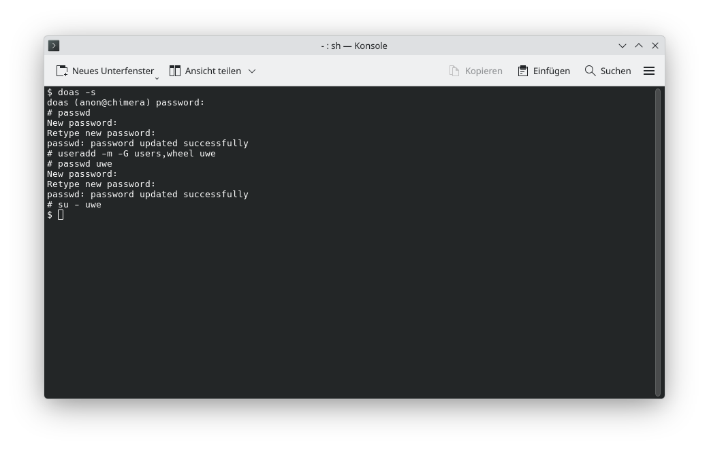

#### (optional) start sshd
This step can be skipped if the installation is done locally
```
doas dinitctl enable sshd
```
#### (optional) get the IP Address of our Install Environment
```
ip a
```
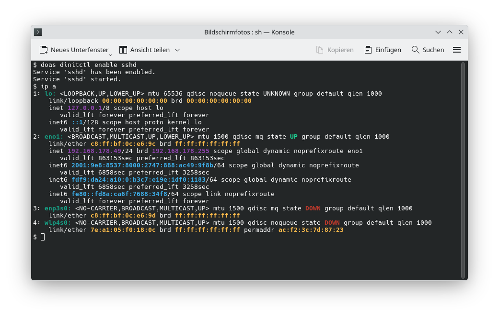

At this point you can either continue the installation locally or ssh into the Installation Environment and continue from remote 

All the following steps need to be performed with superuser (root) privileges

```
doas -s
```
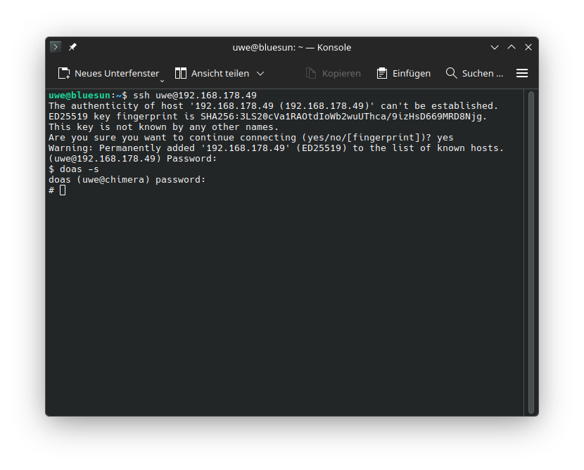

### (optional) update the installation environment
If you use the official Chimera Live Image you now have to update, make the __users__ repository available and install some tools

```
doas -s
apk update
apk upgrade --latest
apk add chimera-repo-user
apk update
apk upgrade --latest
apk add parted nvme-cli tmux
```
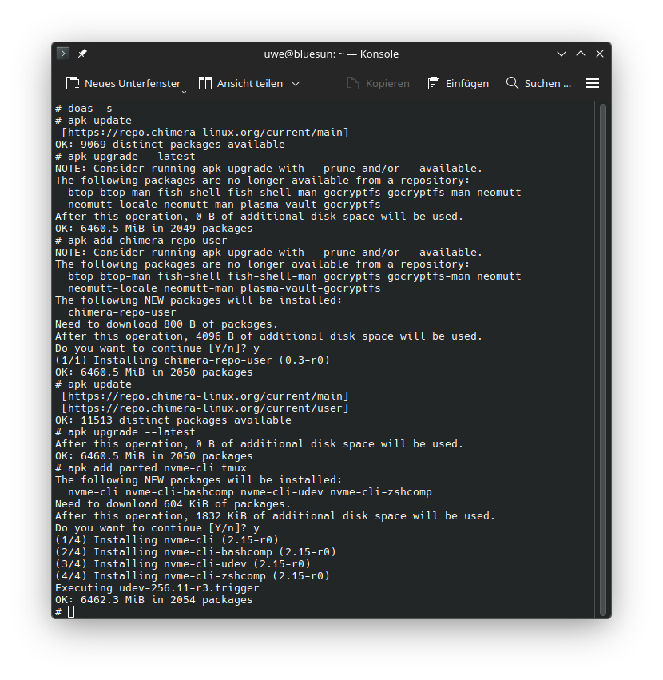

### prepare Installation target

our target device is called __/dev/nvme0n1__ because it's a [NVMe Express m.2 SSD](https://en.wikipedia.org/wiki/NVM_Express) [block device](https://en.wikipedia.org/wiki/Device_file#Block_devices) other valid targets are
```
/dev/vd?
/dev/sd?
/dev/nvme?n?
/dev/mmcblk?
```
Note: replace ? with the number/letter that specifies your target device

#### sanitize the target device

##### Wipe the device
Remove all File system, RAID and Partition Table signatures from target device
```
wipefs -a /dev/nvme0n1
```

##### (optional) secure erase the target drive

For NVME SSDs perform ```nvme sanitize /dev/nvme0 -a 0x02``` and for all other block devices perform ```blkdiscard -vfz /dev/nvme0n1```.

Note: This operation can take a long time depending on size and speed of the target drive.

#### Partitioning the target device

##### Check that the target is indeed empty
```
parted /dev/nvme0n1 print
```
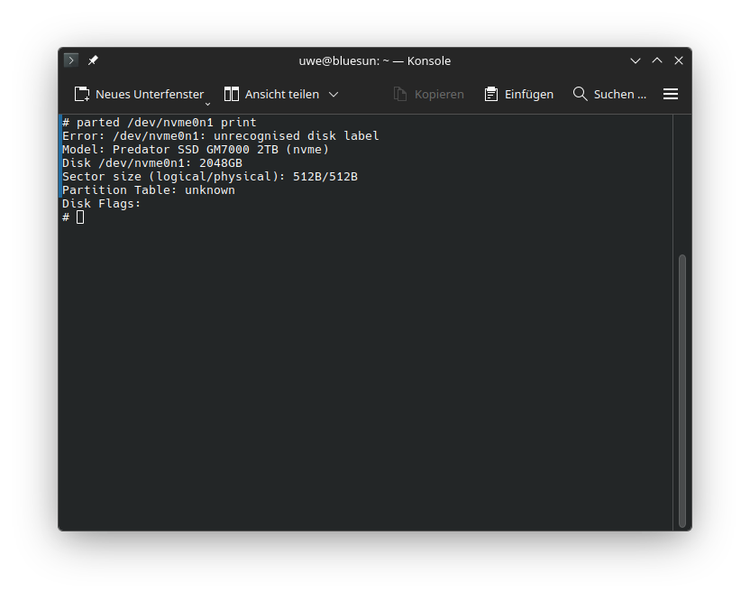

##### Create the Partition Table and Partitions
```
parted /dev/nvme0n1 mklabel gpt
parted /dev/nvme0n1 mkpart primary fat32 0% 2.5GB
parted /dev/nvme0n1 name 1 esp
parted /dev/nvme0n1 set 1 esp on
parted /dev/nvme0n1 set 1 boot on
parted /dev/nvme0n1 mkpart primary 2.5GB 100%
parted /dev/nvme0n1 name 2 LUKS-crypt
```

##### Check that the target device is correctly partitioned
```
parted /dev/nvme0n1 print
```
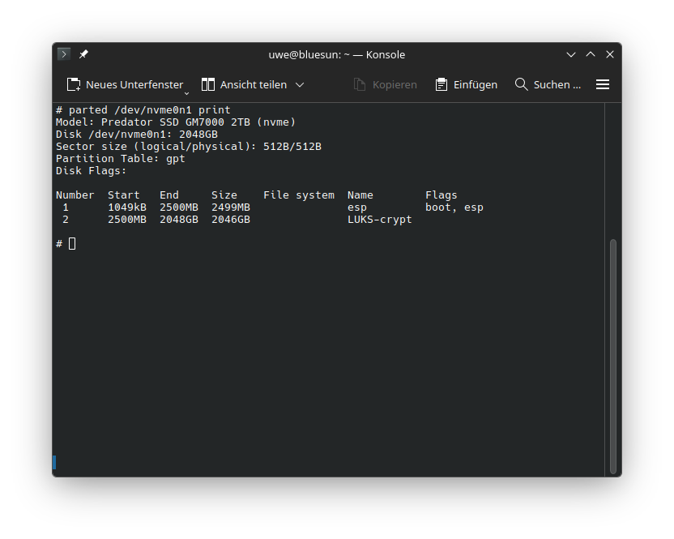

#### EFI File system creation
```
mkfs.fat -F 32 -n EFI /dev/nvme0n1p1
```

#### LUKS Partition creation
```
cryptsetup luksFormat /dev/nvme0n1p2
```
unlock the LUKS Container and map it to __/dev/mapper/crypt__
```
cryptsetup luksOpen /dev/nvme0n1p2 crypt
```
(optional) enable discards on __LUKS__

SSD/SD/MMC block devices should enable discards
```
cryptsetup refresh --persistent --allow-discards crypt
```
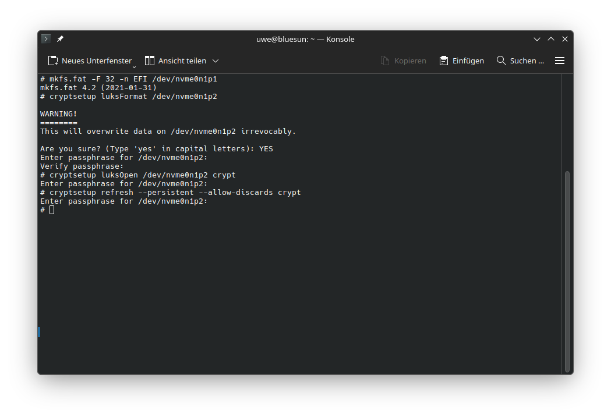

#### LVM configuration

Create a Physical Volume (__PV__) mapped to  our __LUKS__ Container and a Volume Group (__VG__) named __system__ 
Note: the Physical Volume (__PV__) creation on LUKS container is implicit.
```
vgcreate system /dev/mapper/crypt
```
We create two Logical Volumes (__LV__) in our Volume Group (__VG__) __system__. 

The first __LV__ contains our swap. We name it __swap__.

A good size for it is RAM Size * 2.5
```
lvcreate --name swap -L 80G system
```
The Second __LV__ contains our __BTRFS__ File System. We name it __root__. 
```
lvcreate --name root -l 100%free system
```
The __LVs__ are mapped into the system as ```/dev/{VG}/{LV}``` and ```/dev/mapper/{VG}-{LV}```
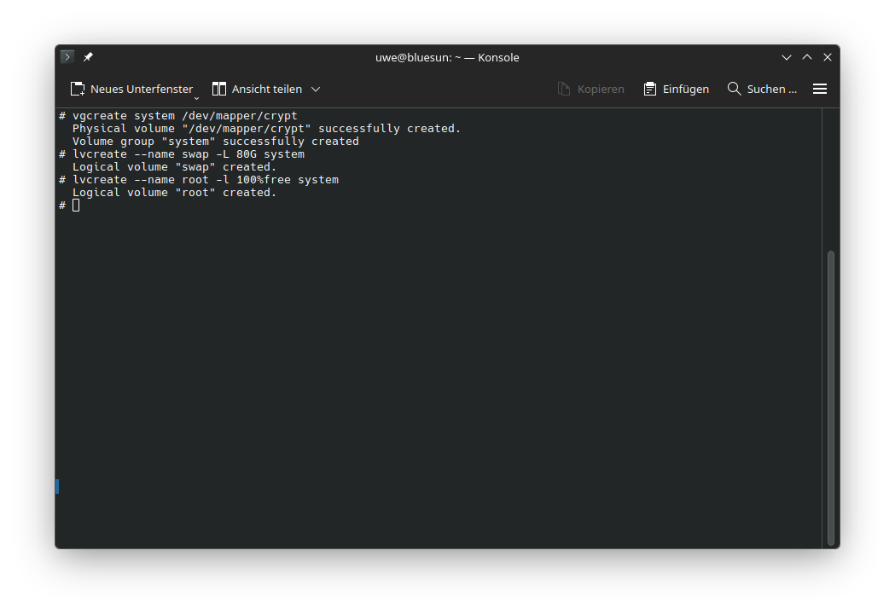

#### File system Creation

Create swap on ```/dev/system/swap``` and name it __swapfs__
```
mkswap /dev/system/swap -L swapfs
```
Enable swap
```
swapon /dev/system/swap
```
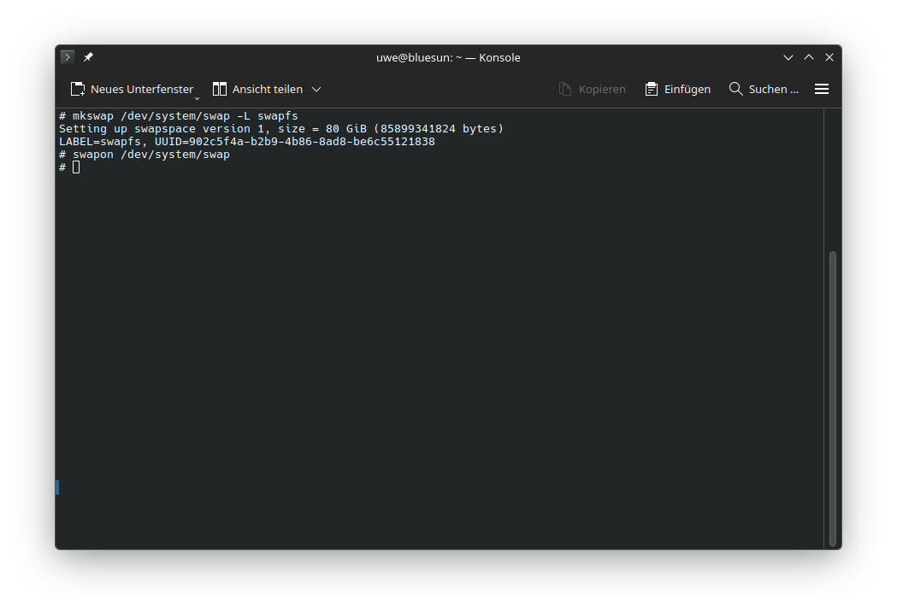

Create BTRFS on ``/dev/mapper/system-root`` and name it __rootfs__
```
mkfs.btrfs -f -L rootfs /dev/mapper/system-root
```
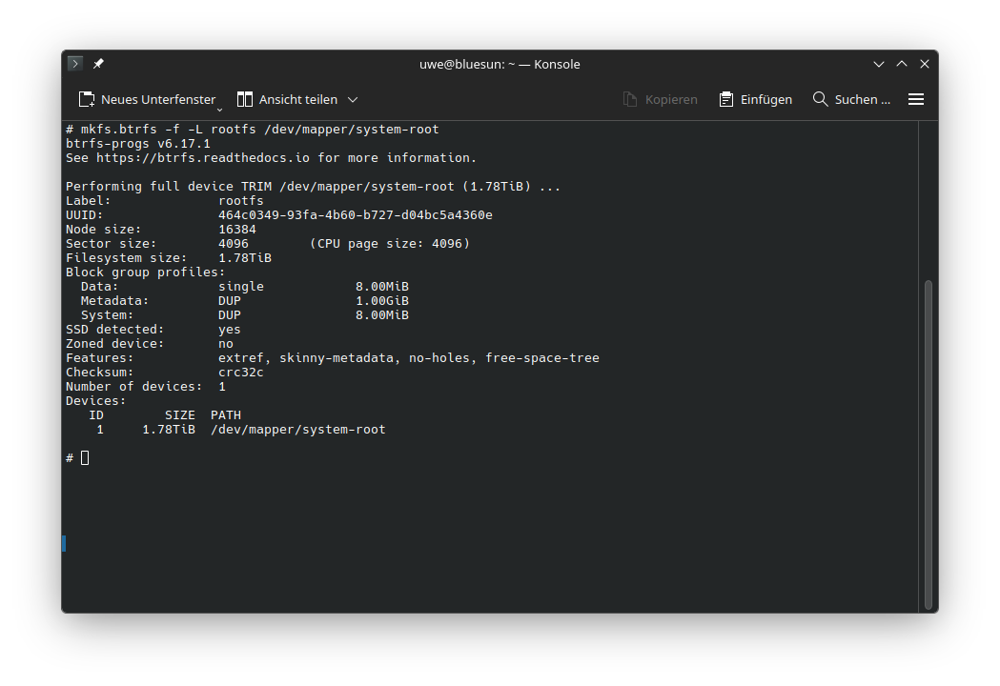

Create the BTRFS Subvolumes
```
mount -v -t btrfs -o ssd,compress=zstd:11,subvol=/ /dev/system/root /media/root
btrfs subvolume create /media/root/@
btrfs subvolume create /media/root/@home
btrfs subvolume create /media/root/@root
btrfs subvolume create /media/root/@var@log
btrfs subvolume create /media/root/@snapshots
btrfs subvolume create /media/root/@home/.snapshots
```
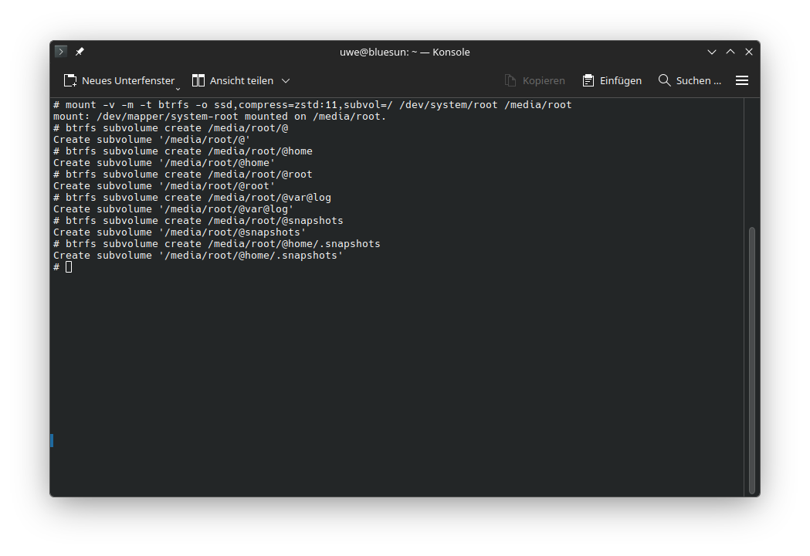

check if all is done correctly
```
btrfs subvolume list /media/root
```
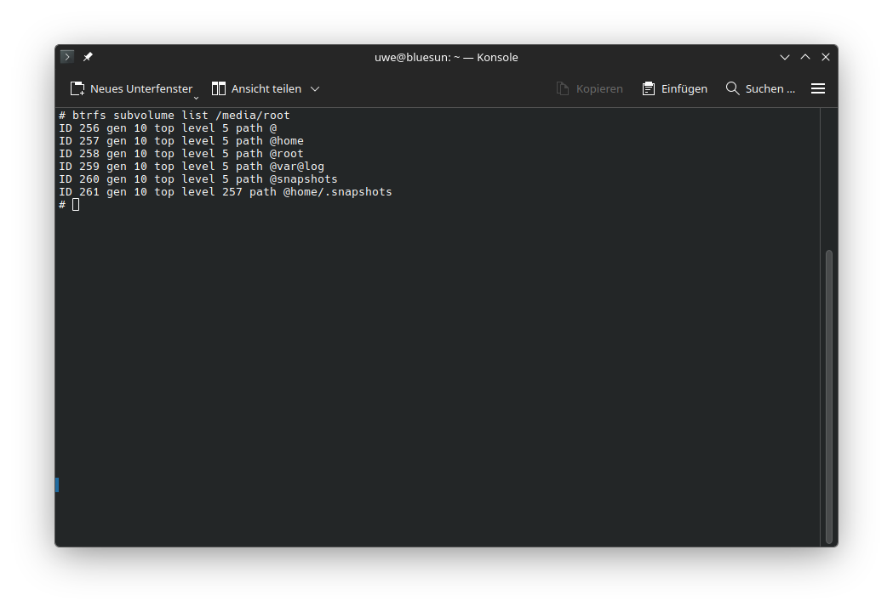

Set __@__ as the __default__ subvolume
```
btrfs subvolume set-default /media/root/@
```
check if it's set correctly
```
btrfs subvolume get-default /media/root
```
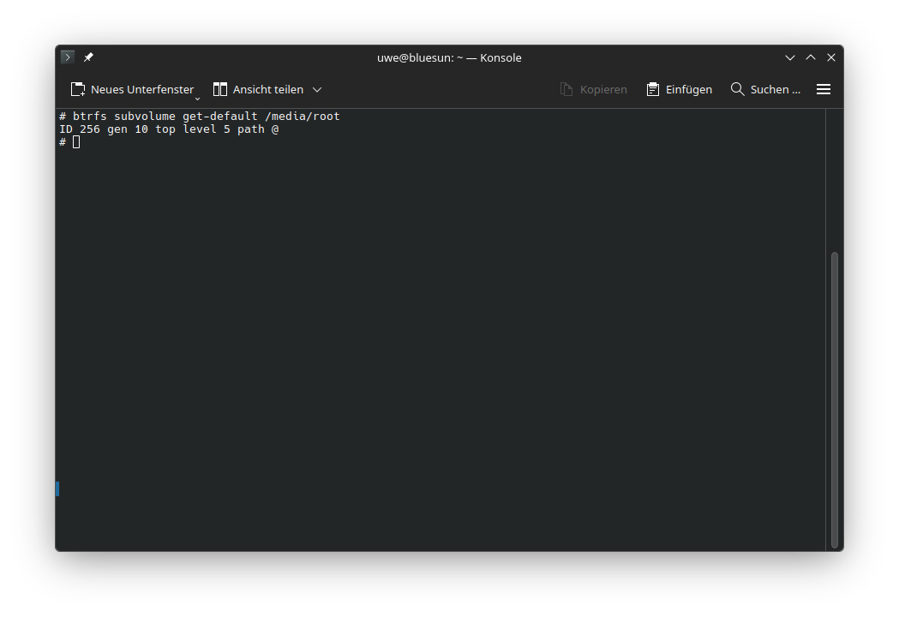
cleanup
```
umount /media/root
```
#### Mount File systems for use in the chroot Environment
```
mount -t btrfs -o compress=zstd:11,ssd,noatime,subvol=/@ /dev/system/root /media/root
chmod 755 /media/root
mount -m -t btrfs -o compress=zstd:11,ssd,noatime,subvol=/@root /dev/system/root /media/root/root
mount -m -t btrfs -o compress=zstd:11,ssd,noatime,subvol=/@var@log /dev/system/root /media/root/var/log
mount -m -t btrfs -o compress=zstd:11,ssd,noatime,subvol=/@snapshots /dev/system/root /media/root/.snapshots
mount -m -t btrfs -o compress=zstd:11,ssd,noatime,subvol=/@home /dev/system/root /media/root/home
mount -m -t vfat /dev/nvme0n1p1 /media/root/boot
```
check if everything is mounted in the right place
```
findmnt -R /media/root
```
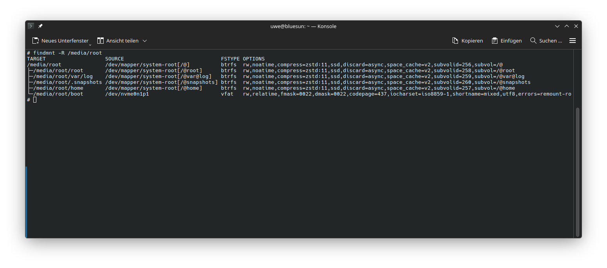

### Bootstrap Gentoo Linux

Consult the [Gentoo Handbook](https://wiki.gentoo.org/wiki/Handbook:AMD64/Installation/Stage) for validation steps and in depth explanations.

Reminder: Make sure you use the correct URL for your chosen mirror and stage file.
```
cd /media/root
curl -O https://eu.mirror.ionos.com/linux/distributions/gentoo/gentoo/releases/amd64/autobuilds/current-stage3-amd64-desktop-openrc/stage3-amd64-desktop-openrc-20260614T170130Z.tar.xz
tar xpf stage3-*.tar.xz --xattrs-include='*.*' --numeric-owner -C /media/root
```
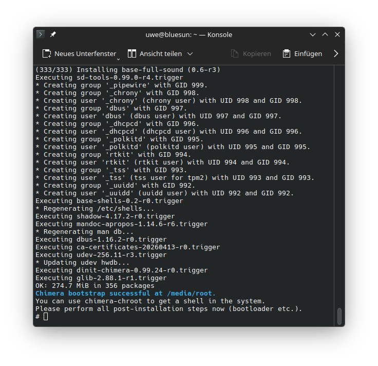

### Copy DNS setting from the Install Environment to the chroot

```
cp --dereference /etc/resolv.conf /media/root/etc/
```

### Put a sane __make.conf__ in place
This __/etc/portage/make.conf__ file is set up for
a 8 Cores 16 Threads x86-64-3 system with 32 GB of RAM
Note: Don't forget to set __Gentoo_Mirrors=__ to your local mirror

```
cat << 'EOF' >  /etc/portage/make.conf
# Please consult /usr/share/portage/config/make.conf.example for a more
# detailed example.
COMMON_FLAGS="-march=x86-64-v3 -O2 -pipe"
CFLAGS="${COMMON_FLAGS}"
CXXFLAGS="${COMMON_FLAGS}"
FCFLAGS="${COMMON_FLAGS}"
FFLAGS="${COMMON_FLAGS}"
RUSTFLAGS="${RUSTFLAGS} -C target-cpu=x86-64-v3"
#conf for 8c/16t with 32 GB RAM
MAKEOPTS="-j8 -l17"

# NOTE: This stage was built with the bindist USE flag enabled

# This sets the language of build output to English.
# Please keep this setting intact when reporting bugs.
LC_MESSAGES=C.UTF-8

GENTOO_MIRRORS="https://eu.mirror.ionos.com/linux/distributions/gentoo/gentoo/"
#Tell thesystem we want to run current switch to "AMD64" for stable
ACCEPT_KEYWORDS="~amd64"

EOF
```

### chroot into the new Gentoo Installation

```
sudo arch-chroot /media/root
source /etc/profile
export PS1="(chroot) ${PS1}"
```
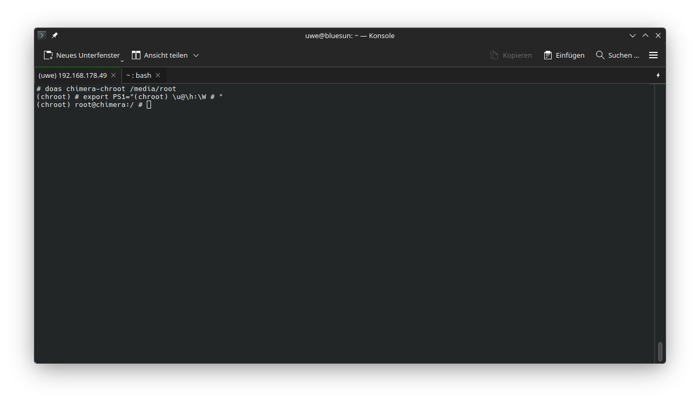

Consult the [Gentoo Handbook](https://wiki.gentoo.org/wiki/Handbook:AMD64/Installation/Base) about Installing the Gentoo base system

#### Check mounts

```
lsblk -o NAME,FSTYPE,UUID,PARTUUID,RO,RM,SIZE,STATE,OWNER,GROUP,MODE,TYPE,MOUNTPOINT,LABEL,MODEL
findmnt -R /
```
Note: UUIDs device names and size can differ.
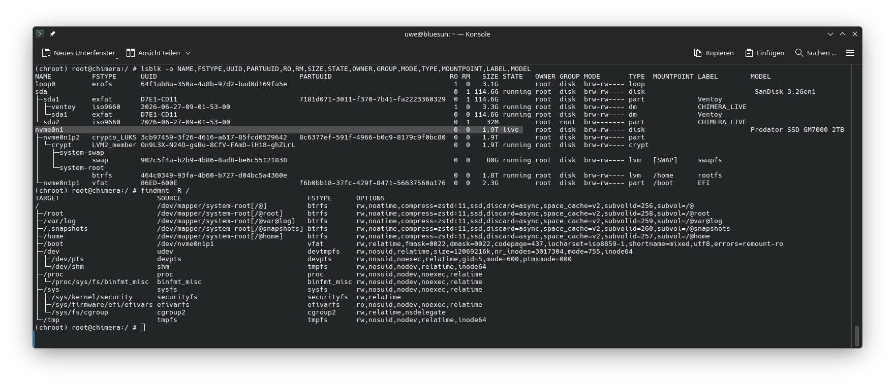


#### Sync up Gentoo Linux
```
emerge-webrsync
```
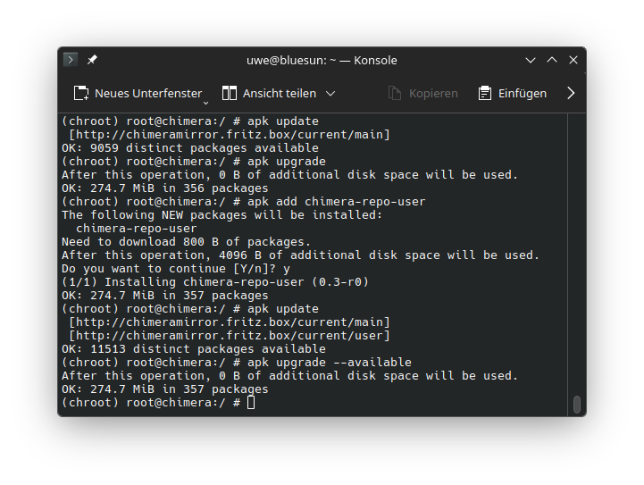

Important: ```emerge-webrsync``` overwrites ```/etc/portage/make.conf``` as of the time this document was written.
Make sure to rerun [Put a sane __make.conf__ in place](#put-a-sane-makeconf-in-place)

#### Configure Repositories

##### Configure the rsync mirror
```
mkdir /etc/portage/repos.conf
cat /usr/share/portage/config/repos.conf | sed 's|rsync://rsync.gentoo.org/gentoo-portage|rsync://eu.mirror.ionos.com/gentoo-portage|g' > /etc/portage/repos.conf/gentoo.conf
```
##### Configure the binary package host mirror

```
mkdir -p /etc/portage/binrepos.conf
cat << 'EOF' > /etc/portage/binrepos.conf/gentoo.conf
[gentoo]
priority = 9959
# NOTE: Must adjust <arch> and <variant> as appropriate!
# sync-uri = https://distfiles.gentoo.org/releases/<arch>/binpackages/<variant>
# x86-64 example sync-uri
sync-uri = https://eu.mirror.ionos.com//linux/distributions/gentoo/gentoo/releases/amd64/binpackages/23.0/x86-64/

# Introduced in portage-3.0.74 for per-repo verification choices
verify-signature = true
# Default value with >=portage-3.0.77
location = /var/cache/binhost/gentoo

[gentoo-x86-64-v3]
priority = 9999
sync-uri = https://eu.mirror.ionos.com//linux/distributions/gentoo/gentoo/releases/amd64/binpackages/23.0/x86-64-v3/
# Introduced in portage-3.0.74 for per-repo verification choices
verify-signature = true
# Default value with >=portage-3.0.77
location = /var/cache/binhost/gentoo-x86-64-v3
EOF
```
##### Configure portage to use binary packages

```
cat <<EOF >> /etc/portage/make.conf
# Appending getbinpkg to the list of values within the EMERGE_DEFAULT_OPTS variable
EMERGE_DEFAULT_OPTS="${EMERGE_DEFAULT_OPTS} --getbinpkg"
BINPKG_FORMAT="gpkg"
USE="${USE} bindist"
EOF
```
Generate the package signing keyring
```
getuto
```

##### Sync up Gentoo Linux
```
emerge --sync
```

##### Set the System Profile

Set the default/linux/amd64/23.0/desktop/plasma (stable) Profile

```
eselect profile list
eselect profile set 7
```


```
#we don't do that to not mess with binhost packages
#emerge --ask --oneshot app-portage/cpuid2cpuflags
#echo "*/* $(cpuid2cpuflags)" > /etc/portage/package.use/00cpu-flags
```

##### Set the GPU

The most commonly used GPUs are
- virgl, QEMU/KVM virtio GPU 
- d3d12, WSL2 virtual Windows GPU
- amdgpu radeonsi, AMD GPUs
- intel, iGPUs/dGPUs
- nouveau, NVidia GPUs (free) 
- nvidia, NVidia GPUs (proprietary)

```
echo "*/* VIDEO_CARDS: -* virgl" > /etc/portage/package.use/00video_cards
```

##### Set the acceptable licenses
```
echo 'ACCEPT_LICENSE="-* @FREE @BINARY-REDISTRIBUTABLE"' >> /etc/portage/make.conf
```

##### Set use flags

```
echo 'USE="${USE} elogind -systemd wayland kde plasma sddm pipewire pulseaudio udev elogind dbus policykit bluetooth networkmanager opengl vulkan qt6"' >> /etc/portage/make.conf
```

##### Updating the __@world__ set
```
emerge --ask --verbose --update --deep --newuse --getbinpkg @world
```

##### emerge news
Portage may output informational messages similar to the following:

```
* IMPORTANT: 22 news items need reading for repository 'gentoo'.
* Use eselect news to read news items.
```

News items were created to provide a communication medium to push critical messages to users via the Gentoo ebuild repository. 
To manage them, use ```eselect news```.
The eselect application is a Gentoo-specific utility that allows for a common management interface for system administration.
In this case, eselect is asked to use its news module.

For the news module, three operations are most used:

- With ```eselect news list``` an overview of the available news items is displayed.
- With ```eselect news read``` the news items can be read.
- With ```eselect news purge``` news items can be removed once they have been read and will not be reread anymore.

##### Clean Up 
```
emerge --ask --pretend --depclean
emerge --ask --depclean
```
##### User Configuration

Set root user account password
```
passwd root
```
Create main user account and set password
```
useradd -m -G wheel,kvm,users,audio -s /bin/bash uwe
passwd uwe
```

###### Install and configure Doas

```
emerge --ask app-admin/doas
echo "permit persist :wheel" > /etc/doas.conf
chown -c root:root /etc/doas.conf
chmod -c 0400 /etc/doas.conf
```

##### Set the hostname
echo myhostname > /etc/hostname

##### Set the Timezone
The Timezone is set to CET

Adjust accordingly.
```
ln -sf ../usr/share/zoneinfo/Europe/Berlin /etc/localtime
```

##### Configure locales
The locales are set to en_US (English, USA) and de_DE (German, Germany)

Adjust accordingly.

Configure /etc/local.gen
```
cat << 'EOF' > /etc/locale.gen
en_US.UTF-8 UTF-8
de_DE.UTF-8 UTF-8
EOF
```

Generate locales
```
locale-gen
```


Set the system default locale
```
eselect locale list
eselect locale set 4
```

Reload session with the new local
```
env-update && source /etc/profile && export PS1="(chroot) ${PS1}"
```


##### Configure keymaps

```
cat << 'EOF' > /etc/conf.d/keymaps
# Use keymap to specify the default console keymap.  There is a complete tree
# of keymaps in /usr/share/keymaps to choose from.
keymap="de-latin1-nodeadkeys"

# Should we first load the 'windowkeys' console keymap?  Most x86 users will
# say "yes" here.  Note that non-x86 users should leave it as "no".
# Loading this keymap will enable VT switching (like ALT+Left/Right)
# using the special windows keys on the linux console.
windowkeys="YES"

# The maps to load for extended keyboards.  Most users will leave this as is.
extended_keymaps=""
#extended_keymaps="backspace keypad euro2"

# Tell dumpkeys(1) to interpret character action codes to be
# from the specified character set.
# This only matters if you set unicode="yes" in /etc/rc.conf.
# For a list of valid sets, run `dumpkeys --help`
dumpkeys_charset=""

# Some fonts map AltGr-E to the currency symbol instead of the Euro.
# To fix this, set to "yes"
fix_euro="NO"
EOF
```

##### Generate Machine ID
```
dbus-uuidgen --ensure=/etc/machine-id
```


##### Install NetworkManager

```
echo 'USE="${USE} networkmanager"' >> /etc/portage/make.conf
emerge --ask net-misc/networkmanager
rc-update add NetworkManager default
```

##### Install syslog-ng

```
emerge --ask app-admin/syslog-ng
emerge --ask app-admin/logrotate
rc-update add syslog-ng default
```

##### Install Cron

```
emerge --ask sys-process/cronie
rc-update add cronie default
```

##### Install NTP

```
emerge --ask net-misc/chrony
rc-update add chronyd default
```

##### Enable sshd

```
rc-update add sshd default
```

##### Install File indexing

```
emerge --ask sys-apps/mlocate
```

##### Install bash completion

```
emerge --ask app-shells/bash-completion
```

##### Install gentoolkit

```
emerge --ask app-portage/gentoolkit
```

##### Install File Sytem tools

```
emerge --ask sys-fs/cryptsetup
emerge --ask sys-fs/btrfs-progs
emerge --ask sys-fs/dosfstools
emerge --ask sys-fs/xfsprogs
emerge --ask sys-fs/e2fsprogs
emerge --ask sys-fs/ntfs3g
emerge --ask sys-fs/f2fs-tools
emerge --ask sys-fs/mdadm
emerge --ask dev-python/zstandard
emerge --ask sys-block/io-scheduler-udev-rules
```

##### Install the Logical Volume Manager

Set the USAGE flag
```
cat << 'EOF' >> /etc/portage/package.use/lvm2
#Enable support for the LVM daemon and related tools
sys-fs/lvm2 lvm
EOF
```
Install and enable LVM
```
emerge --ask sys-fs/lvm2
rc-update add lvm boot
```

##### Build /etc/fstab
```
emerge --ask sys-fs/genfstab
genfstab -U / >> /etc/fstab
```
check generated file
```
cat /etc/fstab
```
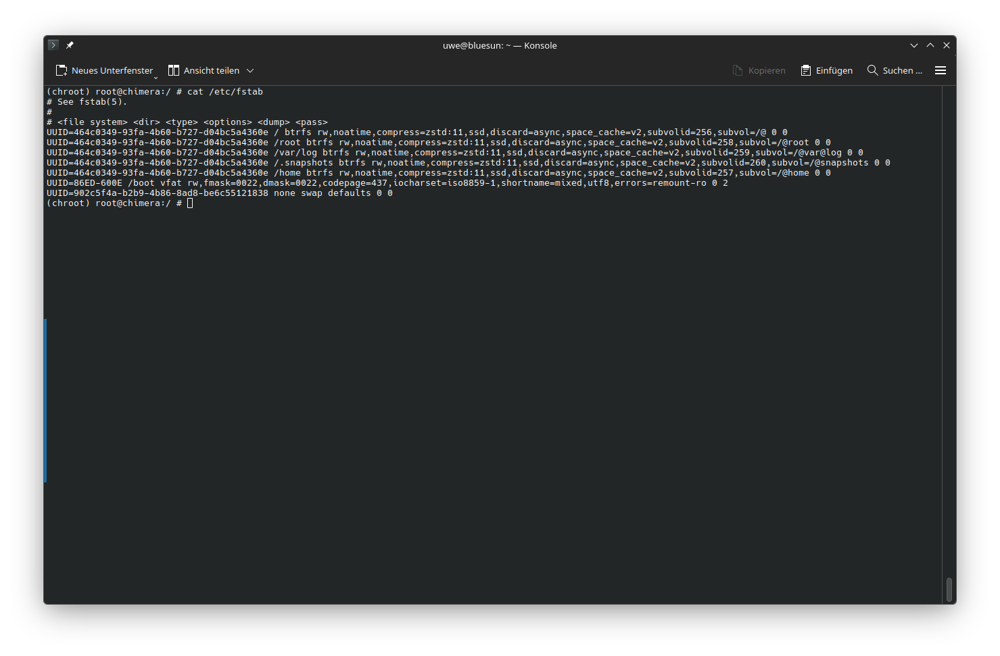

##### Build ```/etc/crypttab```
Get the __UUID__ for the LUKS Container on ```/dev/nvme0n1p2```

```
lsblk -o NAME,FSTYPE,UUID,TYPE,MOUNTPOINT,LABEL
```
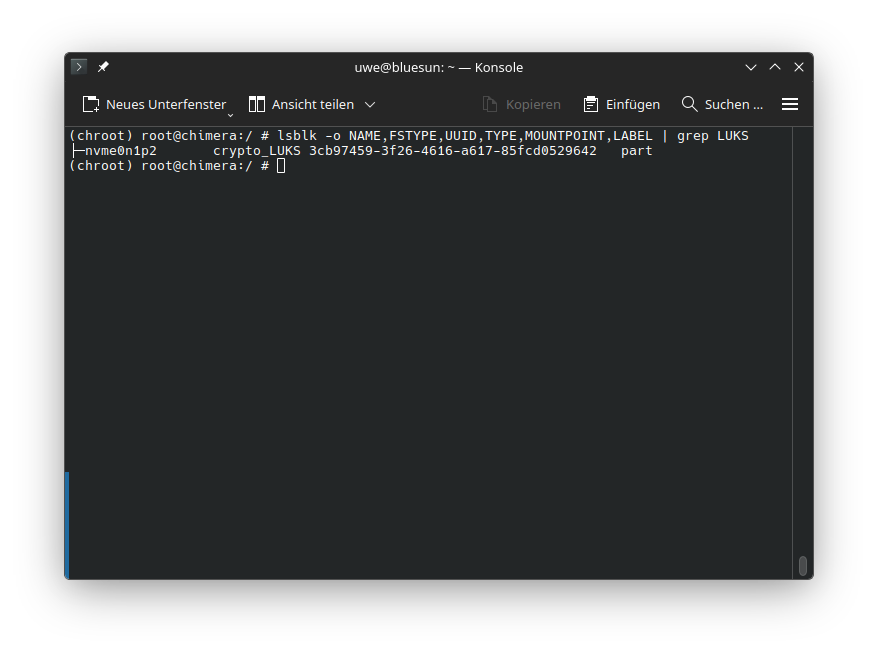

Write ```/etc/crypttab```

```
echo "crypt UUID=1e5b53d9-03d8-4545-803e-3cc69eeac52d none luks,discard" > /etc/crypttab
```
##### Install Linux Firmware
```
emerge --ask sys-kernel/linux-firmware
emerge --ask sys-firmware/sof-firmware
```
##### Install the Linux Kernel
Make sure that __ugrd__ and __grub__ are used by the kernel

```
cat << 'EOF' >> /etc/portage/package.use/installkernel
sys-kernel/installkernel -dracut ugrd grub
EOF
```
Make sure that Grub uses the EFI
```
echo 'GRUB_PLATFORMS="efi-64"' >> /etc/portage/make.conf
```
make sure that external kmods get auto rebuild
```
echo 'USE="${USE} dist-kernel"' >> /etc/portage/make.conf
```

Misc config (not needed?)

```
mkdir -p /etc/kernel
echo "quiet splash" > /etc/kernel/cmdline
mkdir -p /etc/cmdline.d
ln -s /etc/kernel/cmdline /etc/cmdline.d/00-installkernel.conf
```

Install the gentoo default kernel binary
```
emerge --ask sys-kernel/gentoo-kernel-bin
```

Installkernel can be re-emerged and will pull UGRD

```
emerge -ask sys-kernel/installkernel
```

##### Install ZFS support

```
emerge --ask sys-fs/zfs
```
To force an initramfs rebuild, emerge --config can be used on dist-kernel packages:
```
emerge --config sys-kernel/gentoo-kernel-bin
```
##### Install GRUB
```
emerge --ask sys-boot/grub
grub-install --efi-directory=/boot
grub-mkconfig -o /boot/grub/grub.cfg
emerge sys-kernel/installkernel[grub]
```

##### Install some tools
```
emerge dev-vcs/git
emerge sys-process/btop
emerge app-misc/fastfetch
emerge app-misc/tmux
```

##### (optional) QEMU/KVM VM guest agent services
```
emerge --ask app-emulation/spice-vdagent
emerge --ask app-emulation/qemu-guest-agent
rc-update add spice-vdagent default
rc-service spice-vdagent start
rc-update add qemu-guest-agent default
rc-service qemu-guest-agent start
```

##### Install KDE
```
emerge --ask kde-plasma/plasma-meta kde-apps/kde-apps-meta
emerge --ask gui-libs/display-manager-init
```

##### Update __@world__ set
```
emerge --ask --verbose --update --deep --changed-use @world
```
###### enable __elogind__
```
rc-update add elogind boot
```
##### Install __SDDM__

```
emerge --ask x11-misc/sddm
emerge --ask kde-plasma/sddm-kcm

usermod -a -G video sddm
cat << 'EOF' > /etc/conf.d/display-manager
CHECKVT=7
DISPLAYMANAGER="sddm"
EOF

cat << 'EOF' > /etc/sddm.conf
[Users]
MaximumUid=60000
MinimumUid=1000
EOF

rc-update add display-manager default
rc-service display-manager start
```

##### Enable __seatd__
```
echo "sys-auth/seatd server" > /etc/portage/package.use/seatd
emerge sys-auth/seatd
rc-update add seatd default
rc-service seatd start
usermod -aG seat sddm
usermod -aG seat uwe
```


##### Cleanup
```
eclean-dist
eclean-pkg
rm /stage3-*.tar.*
```
All done time to exit the chrot
```
exit
````

And reboot the machine
```
sudo reboot
```
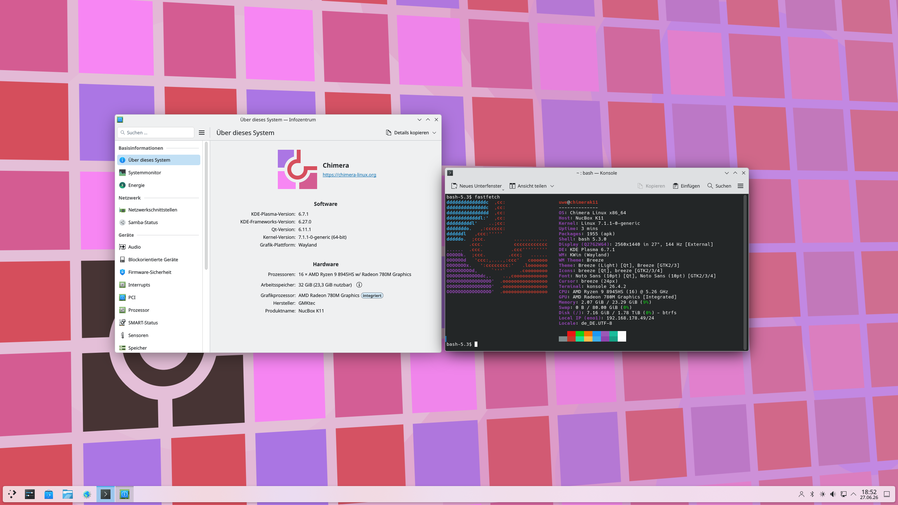
